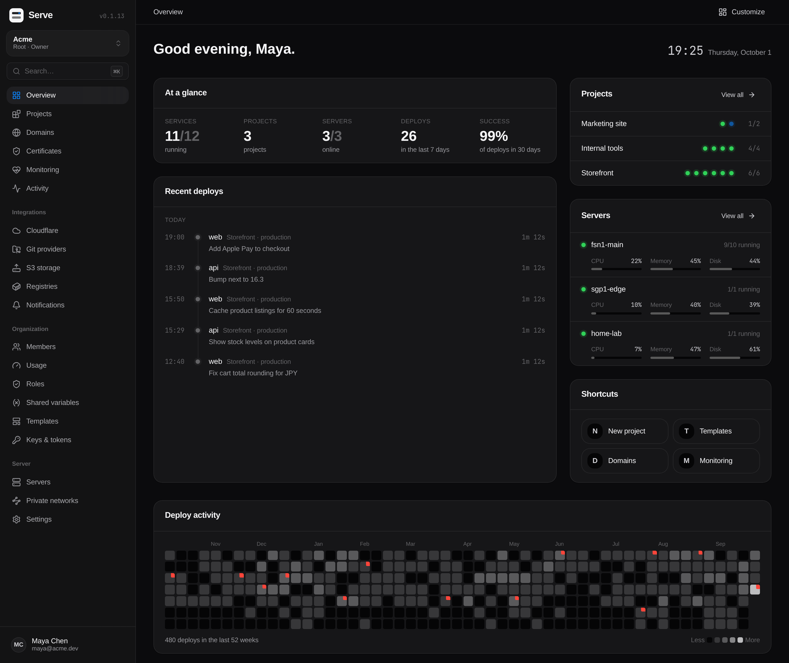

<p align="center">
  
</p>

<h1 align="center">Serve</h1>

<p align="center"><strong>Your own cloud for apps, databases and services.</strong></p>

<p align="center">
  Push to deploy, get a domain with HTTPS and manage it all from one dashboard, on servers you control.
</p>

<p align="center">
  <a href="https://serve.bd">Website</a> ·
  <a href="https://serve.bd/docs/">Docs</a> ·
  <a href="https://serve.bd/templates/">Templates</a> ·
  <a href="https://github.com/serve-bd/serve">GitHub</a>
</p>



## Start in one minute

Run this on a Linux server with 2 GB of RAM or more:

```bash
curl -fsSL https://serve.bd/install.sh | bash
```

Then open the dashboard and create your account. That's it.

## Why Serve

- **Your servers, your data.** Serve runs on machines you own or rent. No monthly bill per app, no lock-in.
- **Push to deploy.** Connect GitHub or any Git host. Every push builds and goes live.
- **Databases that take care of themselves.** PostgreSQL, MySQL, MariaDB, MongoDB, Redis, Valkey and
  ClickHouse, with scheduled backups and one-click restore.
- **One click for popular apps.** More than 480 ready templates: n8n, Plausible, Ghost, Nextcloud,
  Grafana and many more.
- **Domains and HTTPS, done.** Add a domain and get a certificate that renews itself.
- **Made for teams.** Roles, project access, two-factor sign-in and an activity log.

## Features that stand out

- **[Database branching](https://serve.bd/features/database-branching/)**: a full copy of your data, to test a
  change safely. Personal data can be hidden.
- **[Pull request previews](https://serve.bd/features/pull-request-previews/)**: every pull request
  becomes its own live app, with its own copy of the database.
- **[Servers without a public IP](https://serve.bd/features/servers-without-public-ip/)**: run apps on
  a machine at home or in the office, with no open ports.
- **[Git to production](https://serve.bd/features/git-to-production/)**,
  **[one-click services](https://serve.bd/features/one-click-services/)**,
  **[domains and HTTPS](https://serve.bd/features/domains-and-https/)** and
  **[teams](https://serve.bd/features/teams/)**.

See [everything Serve does](https://serve.bd/features/).

## Open source

Serve is free and open source under the Apache 2.0 license. Star it on
[GitHub](https://github.com/serve-bd/serve) and follow the
[changelog](https://github.com/serve-bd/serve/releases).

This repository holds the serve.bd website. To work on it, see [CONTRIBUTING.md](CONTRIBUTING.md).

Questions? Write to [contact@serve.bd](mailto:contact@serve.bd).
